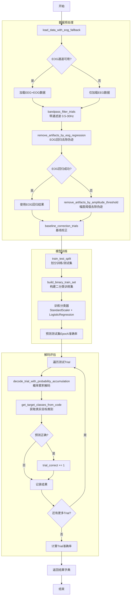

### p300_processing_test

- **状态 1：提示阶段 (Cue Phase)**
    
    - 节点内部随机或按序生成当前轮次的 Target ID（例如：2号图）。
        
    - 节点通过 ROS2 Topic 发送带有 Target ID 和对应图片的 Message 给 Unity。
        
    - Unity 收到后，在 2 号图上加上显眼的红框，持续 2-3 秒，让用户集中注意力。
        
- **状态 2：刺激与缓冲阶段 (Flashing & Buffering Phase)**
    
    - 提示结束后，Unity 开始执行打乱顺序的行列闪烁。
        
    - 每次闪烁，Unity 通过 UDP 向这个 Python 节点发送 `triggerID`（如前文代码所述）。
        
    - **同时**，节点内部的另一个线程（或回调）在不断接收脑电数据，并塞入一个基于 Numpy 预分配好的大规模 Ring Buffer（环形缓冲区）或 List 中。
        
    - 节点收到 UDP `triggerID` 的瞬间，记录下当前 Buffer 的时间戳或写指针位置，并在内部打上标签（如果是 Target ID 对应的行/列则标为 1，否则标为 0）。
        
- **状态 3：离线校准阶段 (Calibration Phase)**
    
    - 当设定的轮次（比如 30 个 Target，每轮闪 10 次）全部跑完后，节点停止发送图片和接收数据。
        
    - 直接从内存的 Buffer 中根据之前记录的指针位置，切分出所有的 Epoch (例如刺激后 0~800ms)。
        
    - 在同一个脚本里，顺滑地调用 `StandardScaler` 和 `LinearDiscriminantAnalysis` 进行模型训练，直接生成 LDA 参数，并原地切换到**在线预测模式**。

### 1. 中央控制大脑 (Central Controller Node - Python)

这个模块是整个系统的“导演”，它合并了你图中的 `publisher` 和 `pretraining`，主要承担以下功能：

- **状态机调度 (State Machine)**：控制实验流程。比如：空闲 -> 发送提示 (Cue) -> 等待刺激结束 -> 下一轮提示 -> 收集完毕进入校准 (Calibration) -> LDA训练 -> 切换至在线预测 (Online)。
    
- **图像与指令发布 (Publisher)**：
    
    - 启动时，读取本地预定义的6张目标图片，通过 ROS2 `/image_seg` 话题发送给 Unity。
        
    - 在每一轮 (Trial) 开始时，随机或按序生成一个 **Target ID**（比如让用户看第 2 张图），并通过 ROS2 话题或 TCP 发送“高亮提示指令”给 Unity。
        
- **多路数据接收与对齐 (Data Logger & Synchronizer)**：
    
    - **EEG 监听线程**：持续接收脑电头盔发来的连续数据，并推入内存中的 `CircularEEGBuffer`（环形缓冲区）。
        
    - **UDP 监听线程**：接收 Unity 闪烁时发来的 `triggerID`，并在接收瞬间记录下当前 Buffer 的时间戳/写指针位置。
        
- **自动打标签 (Auto-Labeling)**：根据当前轮次的 Target ID 和收到的 `triggerID`，在内存中将数据打上 Ground Truth 标签（目标行/列标为 1，非目标标为 0）。
    
- **离线校准与模型训练 (Offline Calibration & LDA)**：
    
    - 当收集到足够轮次的数据后，根据时间戳从 Buffer 中切分出所有的 Epoch（例如刺激后 0~800ms）。
        
    - 执行带通滤波、基线校准、去伪迹操作。
        
    - 调用 `StandardScaler` 和 `LinearDiscriminantAnalysis` 训练模型，原地保存参数或直接实例化为预测模型对象。
        

### 2. 视觉刺激终端 (P300 Stimulus - Unity C#)

这个模块是“执行者”，它只负责呈现和精确打标，去掉了所有复杂的逻辑运算：

- **图像接收与装载**：订阅 ROS2 的 `/image_seg`，将收到的 6 张图片渲染到 UI 的对应位置（`RawImage`）。
    
- **提示反馈 (Cue Display & Handshake)**：
    
    - 接收 Python 发来的“高亮提示指令”。
        
    - 在指定的图片上显示红框，持续 2-3 秒。
        
    - **握手功能**：红框渲染完成的瞬间，最好能向 Python 回传一个“已就绪”信号，防止 Python 提前开始计时。
        
- **高精度闪烁 (Flashing Execution)**：在提示结束后，执行 P300 的行列随机闪烁逻辑（亮 100ms，暗 75ms）。
    
- **精准 Trigger 发送**：在每一行/列颜色改变的**同一帧**，通过 UDP 向 Python 发送对应的 `triggerID`。必须保证视觉呈现和 UDP 发出之间没有延迟差。
    

### 3. 脑电采集源 (EEG Data Source)

这个模块功能最纯粹，通常是硬件自带的 SDK 或第三方推流工具：

- **连续推流**：以固定的采样率（如 250Hz 或 500Hz）将原始 EEG 信号发送给 Python 的中央控制节点。最好使用 LSL (Lab Streaming Layer) 或高频 TCP/UDP，确保数据包带有精确的硬件时间戳。

今天主要完成了这些功能：

1. 新建在线处理脚本  
- 创建了 [p300_processing_test_online.py](/home/themountaintree/workspace/ROS_Unity_test/src/eeg_processing/eeg_processing/p300_processing_test_online.py)  
- 从离线流程改为在线架构：连续 EEG 缓冲、trigger 切 epoch、trial 内累积判别。

2. 实现校准控制节点  
- 新建并迭代了 [CentralControllerNode.py](/home/themountaintree/workspace/ROS_Unity_test/src/eeg_processing/eeg_processing/CentralControllerNode.py)  
- 校准模式下每个 trial 自动生成 6 张图（1 红 + 5 白，目标随机）。  
- 发布 `/image_seg`，并在消息中附带 `trial/img/target` 元数据。  
- 加入启动延时、QoS 可配（后改为默认 RELIABLE）、发布周期参数化（改为 0.5s）。

3. 完成 Unity 接收与刺激流程改造  
- 迭代了 [P300_Stimulus.cs](/home/themountaintree/workspace/ROS_Unity_test/src/eeg_processing/eeg_processing/P300_Stimulus.cs)  
- 按 `trial_id + img_idx` 组包，避免跨 trial 混图。  
- 修复批次切换、纹理释放、固定格子(3/7)覆盖问题。  
- 支持 QoS 可配并补充调试日志。  
- 新增 ACK 发送：`trial_done=<id>`。

4. 建立 trial 握手同步机制  
- Node 端增加 UDP ACK 监听（`ack_port`），Unity 闪烁结束回传 `trial_done`。  
- Node 收到 ACK 才进入下一 trial，实现严格状态切换同步。  
- 新增 ACK 来源/内容日志，便于排障。

5. 修复关键联调问题  
- 识别并解决“通信建立但不切换”的根因：ACK 目标 IP 不匹配。  
- 将 trigger UDP 与 ACK UDP 解耦（`udpTargetIP` 与 `udpAckTargetIP`）。  
- 解决“首轮不稳定、跨 trial、节点停后Unity仍跑”等一系列时序问题。

6. 工程配置更新  
- `setup.py` 增加 `central_controller_node` 入口。  
- `package.xml` 增补 `sensor_msgs`、`python3-pil` 依赖。