# Decode Phase Timeline

```mermaid
gantt
    title 单次 Decode Trial 时间线 (Node3_1 默认参数)
    dateFormat x
    axisFormat %S.%L秒

    section 发布
    发布6图(0.5s间隔,2.5s)                :active, p1, 0, 2500
    batch_start                            :cmd1, 0, 1
    batch_end+prepare                      :cmd2, 2500, 2501

    section 注视
    图片可见(无闪烁,1.5s)                  :hold, 2500, 4000

    section 启动与闪烁
    stim                                   :cmd3, 4000, 4001
    trial_started(常见立即)                :cmd4, 4000, 4001
    SSVEP闪烁(4.0s)                        :crit, s1, 4000, 8000

    section 采集
    stop                                   :cmd5, 8000, 8001
    EEG采集+FBCCA等待(1.0s)                :c1, 8000, 9000

    section 收尾
    结束并进入下一轮(iti=0s)               :w1, 9000, 9001
```

## 阶段与命令对照

| 时间段 | 阶段 | 时长 | 命令 | Unity动作 |
|--------|------|------|------|-----------|
| 0s | PUBLISHING 开始 | — | `batch_start` | 重置批次状态 |
| 0-2.5s | PUBLISHING | 2.5s | 逐张 `/image_seg` | 接收6张图片 |
| 2.5s | PUBLISHING 结束 | — | `batch_end` | 分配纹理 |
| 2.5s | 进入 HOLD | — | `prepare` | 显示图片，隐藏闪烁框 |
| 2.5-4.0s | HOLD | 1.5s | — | 图片可见，无闪烁 |
| 4.0s | 进入 WAIT_START | 通常≈0s | `stim` | 请求Unity进入闪烁 |
| 4.0s | 进入 STIMULATING | 4.0s | `trial_started`(常见立即) | 开始按频率闪烁 |
| 8.0s | 进入 WAIT_CAPTURE | — | `stop` | 停止闪烁，保留图片 |
| 8.0-9.0s | WAIT_CAPTURE | 1.0s | — | EEG采集，FBCCA解码 |
| 9.0s | 结束或开始下一trial | — | `done`(仅最后一轮) | 最后一轮后隐藏面板 |

> 备注：若未收到 `trial_started`，`DECODE_WAIT_START` 最长等待 `start_wait_timeout_s=15s` 后会强制开始闪烁，后续时间整体右移。
